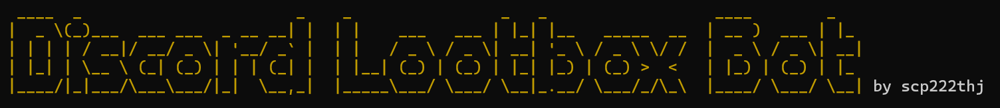

A selfbot that unlocks and redeems Discord's April Fools 2024 avatar decoration by automatically opening lootboxes for you
## ⬇️ Installation 

#### Prerequisites
- **Git**: [Download Git](https://git-scm.com/)
- **Python 3.11+**: [Download Python](https://www.python.org/downloads/)

#### Quick Start
```console
# clone the repo
$ git clone https://github.com/scp222thj/discord-lootbox-selfbot.git

# change the working directory to sherlock
$ cd discord-lootbox-selfbot

# install the requirements
$ python -m pip install -r requirements.txt
```

#### System-specific Notes
**Windows**: Add Python and Git to your PATH if not already done during installation.

**macOS/Linux**: If both Python 2 and 3 are installed, use `python3` and `pip3` instead.

## 🤖 Running the Bot
- Obtain your Discord token ([guide](https://www.youtube.com/watch?v=b1SY4zTNnAE)).
- Launch the bot: `python main.py`
- Enter your token when prompted.

## ⚠️ Disclaimer

This project is not affiliated with, endorsed by, or in any way connected with Discord, Inc. "Discord" is a trademark of Discord, Inc., used here for descriptive purposes only. 

Usage of selfbots is against Discord's Terms of Service and may lead to account consequences. The developer is not responsible for any potential damages or disciplinary actions from using this software. Use at your own risk.
